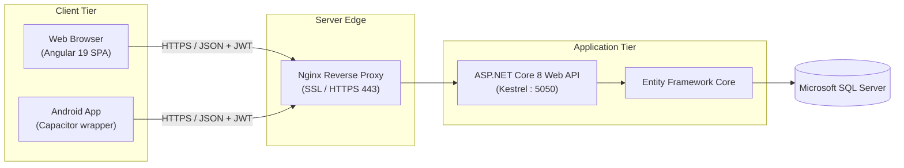
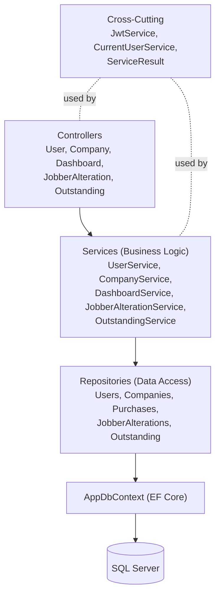
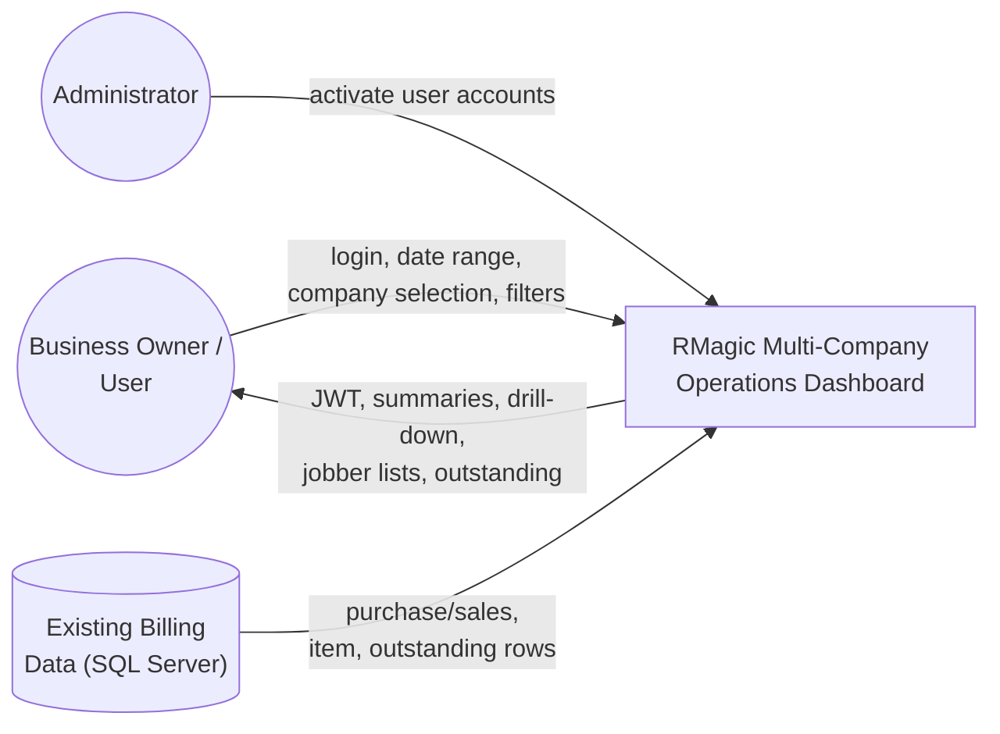
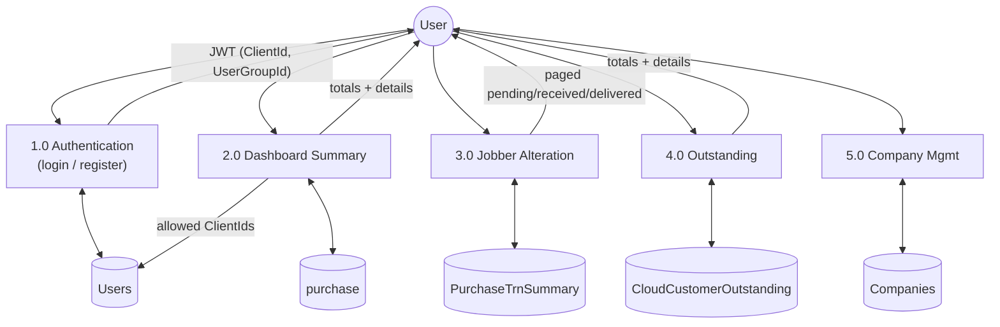
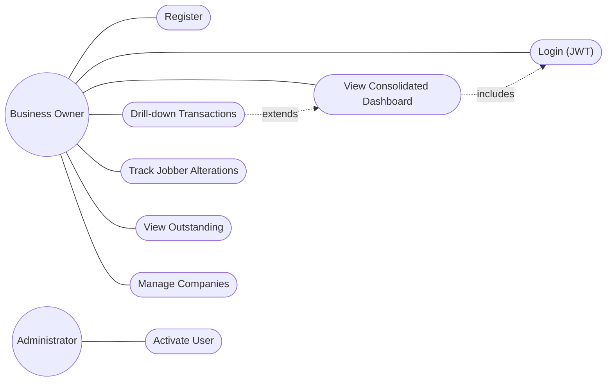
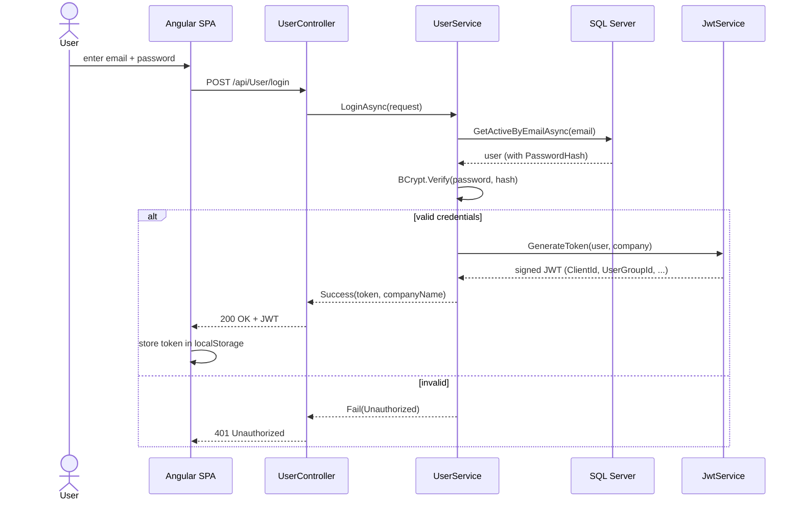
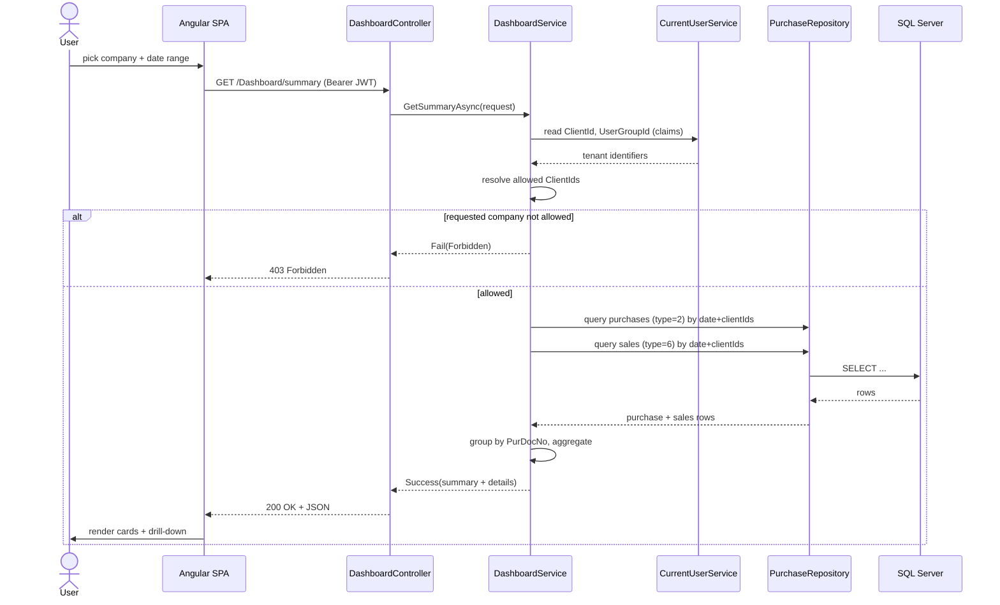
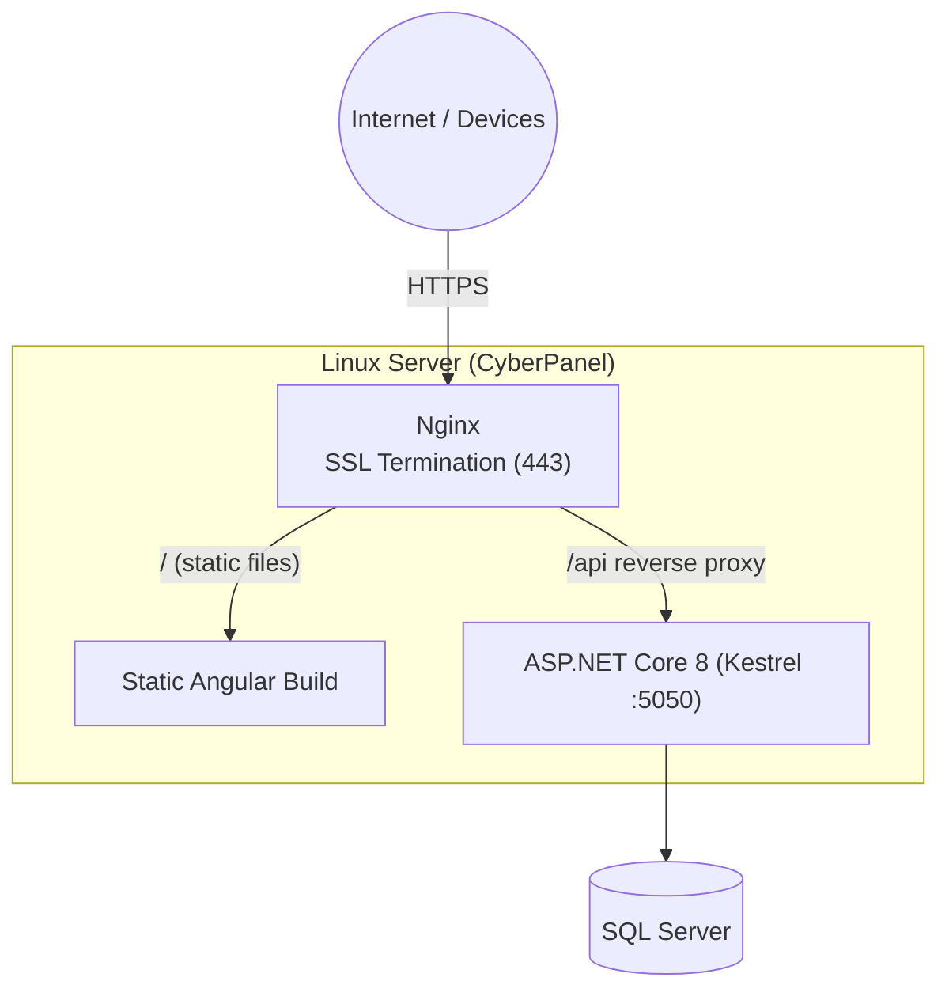

<!--
============================================================================
DISSERTATION DIAGRAMS (Mermaid)
============================================================================
HOW TO TURN THESE INTO IMAGES FOR YOUR WORD DOCUMENT:

Option A (easiest): Open https://mermaid.live , paste one diagram's code
   (everything between ```mermaid and ```), then use Actions > PNG/SVG to
   download. Paste the image into Word at the matching [INSERT FIGURE ...].

Option B (in editor): Install a "Markdown Preview Mermaid" extension in
   VS Code / Cursor, open this file's preview, right-click the rendered
   diagram to copy/save as image.

Option C (command line, needs Node): 
   npx -p @mermaid-js/mermaid-cli mmdc -i Diagrams.md -o diagrams.pdf
   (renders all diagrams to a PDF you can screenshot, or use -o out.png per file)

Figure numbers match the placeholders in Dissertation_RMagic.md.
============================================================================
-->

# Dissertation Diagrams

## Figure 5.1 — High-Level System Architecture



## Figure 5.2 — Layered Backend Architecture (Controller → Service → Repository)



## Figure 5.3 — Entity Relationship (ER) Diagram

```mermaid
erDiagram
    COMPANY ||--o{ USER : "has (ClientId)"
    COMPANY ||--o{ PURCHASE : "has (PurClientId)"
    COMPANY ||--o{ PURCHASETRNSUMMARY : "has (ClientId)"
    COMPANY ||--o{ CLOUDCUSTOMEROUTSTANDING : "has (ClientId)"

    COMPANY {
        int CompanyId PK
        long ClientId AK "unique alternate key"
        string Name
        string GstNumber
        string City
        string State
        bool IsActive
    }
    USER {
        int UserId PK
        string Username
        string Email
        string PasswordHash
        long ClientId FK
        long UserGroupId
        bool IsActive
        bool IsOnHold
    }
    PURCHASE {
        long Id PK
        long PurDocNo
        datetime PurDocDate
        decimal PurGrossAmount
        decimal PurTotalQty
        int PurType "2=purchase,6=sales"
        long PurClientId FK
    }
    PURCHASETRNSUMMARY {
        long Id PK
        string JobberName
        string ProductDesc
        string CategoryDescription
        bool PurtReceived
        bool PurtDelivered
        long ClientId
    }
    CLOUDCUSTOMEROUTSTANDING {
        long Id PK
        long ClientId
        long CustomerId
        string CustomerName
        decimal NetOutstanding
        int AvgOutstandingDays
    }
```

## Figure 5.4 — Context-Level Data Flow Diagram (DFD Level 0)



## Figure 5.5 — Level-1 Data Flow Diagram



## Figure 5.6 — Use-Case Diagram



## Figure 5.7 — Login / JWT Authentication Sequence



## Figure 5.8 — Dashboard Summary Request Sequence (with Isolation)



## Figure 5.9 — Deployment Topology


